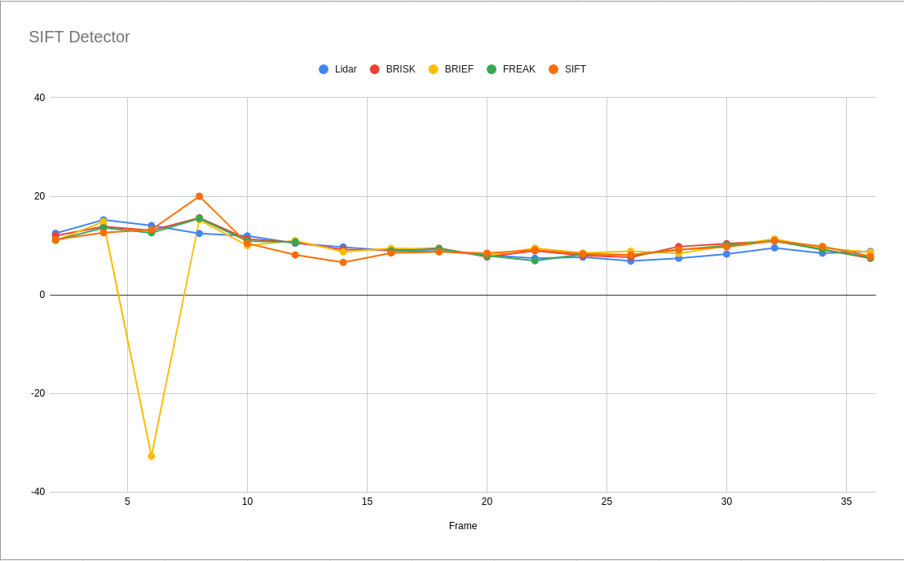
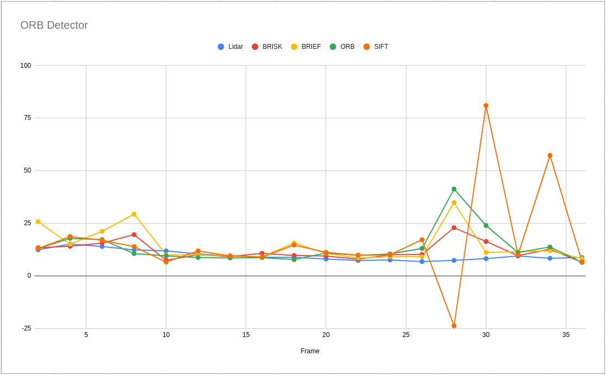

# SFND 3D Object Tracking

Welcome to the final project of the camera course. By completing all the lessons, you now have a solid understanding of keypoint detectors, descriptors, and methods to match them between successive images. Also, you know how to detect objects in an image using the YOLO deep-learning framework. And finally, you know how to associate regions in a camera image with Lidar points in 3D space. Let's take a look at our program schematic to see what we already have accomplished and what's still missing.


In this final project, you will implement the missing parts in the schematic. To do this, you will complete four major tasks: 
1. First, you will develop a way to match 3D objects over time by using keypoint correspondences. 
2. Second, you will compute the TTC based on Lidar measurements. 
3. You will then proceed to do the same using the camera, which requires to first associate keypoint matches to regions of interest and then to compute the TTC based on those matches. 
4. And lastly, you will conduct various tests with the framework. Your goal is to identify the most suitable detector/descriptor combination for TTC estimation and also to search for problems that can lead to faulty measurements by the camera or Lidar sensor. In the last course of this Nanodegree, you will learn about the Kalman filter, which is a great way to combine the two independent TTC measurements into an improved version which is much more reliable than a single sensor alone can be. But before we think about such things, let us focus on your final project in the camera course. 

## Dependencies for Running Locally
* cmake >= 2.8
  * All OSes: [click here for installation instructions](https://cmake.org/install/)
* make >= 4.1 (Linux, Mac), 3.81 (Windows)
  * Linux: make is installed by default on most Linux distros
  * Mac: [install Xcode command line tools to get make](https://developer.apple.com/xcode/features/)
  * Windows: [Click here for installation instructions](http://gnuwin32.sourceforge.net/packages/make.htm)
* Git LFS
  * Weight files are handled using [LFS](https://git-lfs.github.com/)
* OpenCV >= 4.1
  * This must be compiled from source using the `-D OPENCV_ENABLE_NONFREE=ON` cmake flag for testing the SIFT and SURF detectors.
  * The OpenCV 4.1.0 source code can be found [here](https://github.com/opencv/opencv/tree/4.1.0)
* gcc/g++ >= 5.4
  * Linux: gcc / g++ is installed by default on most Linux distros
  * Mac: same deal as make - [install Xcode command line tools](https://developer.apple.com/xcode/features/)
  * Windows: recommend using [MinGW](http://www.mingw.org/)

## Basic Build Instructions

1. Clone this repo.
2. Make a build directory in the top level project directory: `mkdir build && cd build`
3. Compile: `cmake .. && make`
4. Run it: `./3D_object_tracking`.

## Project writeup
### FP.0 parameters setup
- number of frame
- skip frame
- detector and descriptor

### FP.1 Match 3D Objects
Implement `matchBoundingBoxes` function. Given a pairs of matches keypoints between current and previous frame as an input (from `matchDescriptors` function), we then need to match a bounding boxes id (given by YOLO) between the frame as well.

First, we loop throught every matches keypoint and determine which bounding box the keypoint belong to in both current and previous frame. We then keep count a number of this association and create a 2D matrix, example shown below. The vertical axis denote box id from previous frame, and the horizontal denote box id from current frame.

Sample output
```
...
183	0	0	0	0	0	0	0	0	0	0	
0	167	0	0	22	0	0	0	0	0	0	
0	0	25	0	0	0	4	0	0	0	0	
0	0	0	75	0	0	0	0	0	0	2	
0	0	0	0	0	0	0	0	0	0	0	
0	0	0	0	0	97	0	0	0	0	0	

Track frame (previous, current): (0, 0) (1, 1) (2, 2) (3, 3) (5, 5) 
...
```
The last step would be to determine bounding box best matches. I simply take the highest score of eash row as the best matches. The result also shown in the picture above.

From the picture above we can see that there are 183 keypoints from bounding box of ID 0 in previous frame, matches with a keypoints in bounding box of ID 0 in current frame. Same manners for 167 keypoints for bounding box with ID 1 and 25 keypoints for bounding box with ID 2.
A relation between frame is not always exist as can be seen in bonding box with ID 4, the scores are all 0.

### FP.2 Compute Lidar-based TTC
Implement `computeTTCLidar` function. Given Lidar points from previous and current frame, determine Time To Collision. Speacial care need to be taken to handle outlier points.

Instead of using the nearest Lidar point to determine a distance between ego and preceeding car, I uses a centroid of the points instead. This will minimize an effect of having a few outlier points and therefore provide more reliable TTC calculation output.

### FP.3 Associate Keypoint Correspondences with Bounding Boxes
Implement `clusterKptMatchesWithROI` function. Given a matches keypoints between previous and current frame, we need to assign a valid matches keypoints pair to a bounding boxes.

First, we only pay attention to a matches keypoints that are in our bounding box (or ROI). Then we calculate an average distance between matches keypoints from previous to current frame to filter out an outlier. A valid matches keypoint should have a similar distance between keypoints, we remove it if this is not the case.

Sample output:
```
...
Avg.dist: 1.28445 min: 0.128445 max: 6.42227
#keypoint left: 110 , #keypoint removed: 4
...
```

### FP.4 Compute Camera-based TTC
Implement `computeTTCCamera` function. Given matches keypoints and keypoints from previous and current frame, we can estimate Time To Collision based on keypoints detected from camera images.

The function calculate a distance ratio between previous and current frame of each matches points and then take a median value to calculate TTC.

### FP.5 Performance Evaluation 1 (Failure case for TTC estimation from Lidar points)
There are few case that TTC estimation from Lidar points yeild excessive measure.

At frame index 30, Top-view and 3D object shown below, there are a group of outlier point on top of the frame and caused a calculated centroid to shift upward. Therefore, TTC calculation yeild an unrealistic number than it should be.

Estimation from `computeTTCLidar` function output TTC of 25.9257 sec., when manually calculate using a distance from nearest point give 7.2375 sec.
|  | 
|:--:| 
| *TTC from Lidar points: 25.9257 sec., manual estimation: 7.2375 sec.* |

Same scenarios occur at frame index 36, where TTC from Lidar points yield 61.9068 sec. while manual calculation yield 8.32 sec. The higher TTC number came from the fact that there are more points detected at the top of the frame than those at frame index 30.
|  | 
|:--:| 
| *TTC from Lidar points: 61.9068 sec., manual estimation: 8.32 sec.* |

These problem can be address by applied euclidean base filtering to remove outlier points.

### FP.5 Performance Evaluation 2 (TTC estimation from image keypoints using combination of detector and descriptor pairs)
Compair resulting TTC estimation from various feature detector and descriptor to determind best combination. The plot below shown an overall performance.

|  | 
|:--:| 
| *TTC estimation from image keypoints using various combination of detector/descriptor pairs* |


As can be seen from the plot above, combination of `SIFT detector` with  either `BRISK, FREAK, and SIFT` descriptor yield the most reliable TTC estimation. TTC output from SIFT detector is shown below.

|  | 
|:--:| 
| *Best performer, TTC estimation from SIFT detector and various descriptor* |

However, the worse performer is a combination of `ORB detector` with either `BRISK, BRIFT, and ORB` descriptor yield some outlier TTC estimation value. The biggest outlier in these case was from frame index 30, with combination of ORB detector and SIFT descriptor.

|  | 
|:--:| 
| *Worse performer, TTC estimation from ORB detector* |

When look at matches keypoints at the specific frame, shown below, we can see the while there are many number of matches keypoint between frame in the bounding box that we are interest there are also a few points that are not from the preceeding vehicle. This may caused TTC estimation to be way off.

|  | 
|:--:| 
| *Frame 30, ORB/SIFT combination* |

TTC Calculated for this frame is 81.06 sec. while manually calculated TTC based on Lidar point yield 7.2375 sec.
